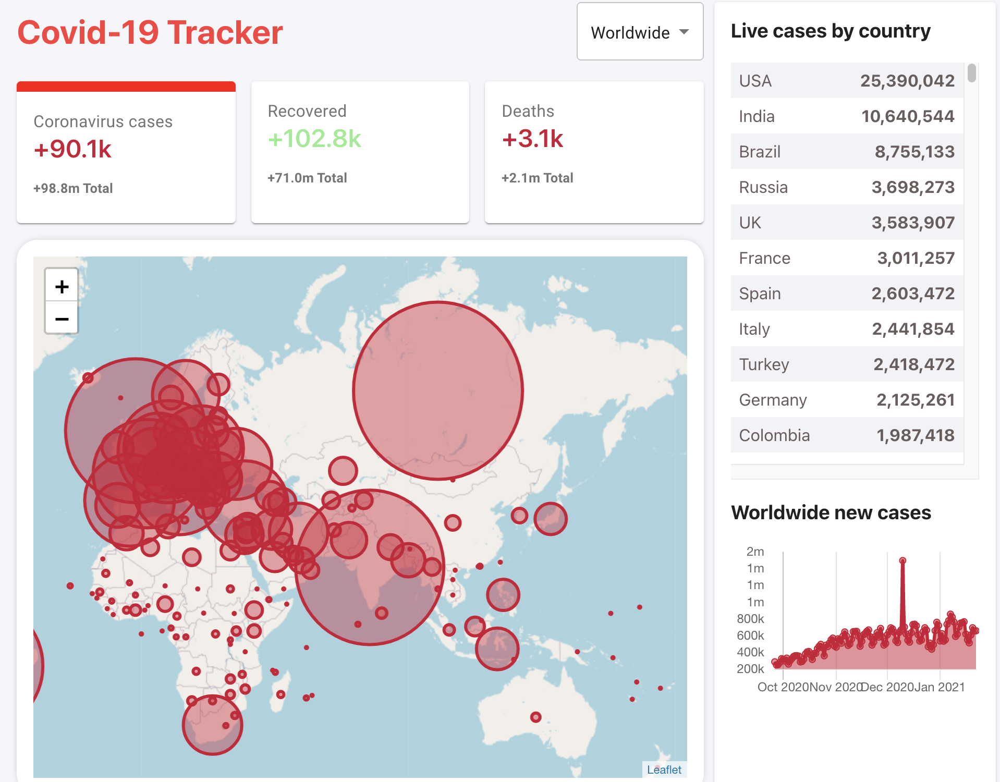

# COVID-19 TRACKER

[Demo app](https://covid-19-tracker-3d6d5.web.app)

- API from [disease.sh](https://disease.sh/)
- Table from [Material-UI](https://material-ui.com/)
- Chart: [react-chartjs-2](https://github.com/jerairrest/react-chartjs-2)
- Map from [leaflet.js](https://leafletjs.com/)

This app was buildt to track all the cases worldwide in real time. Size of red circles indicate amount of cases each country have.
Drop down section to select every country.

